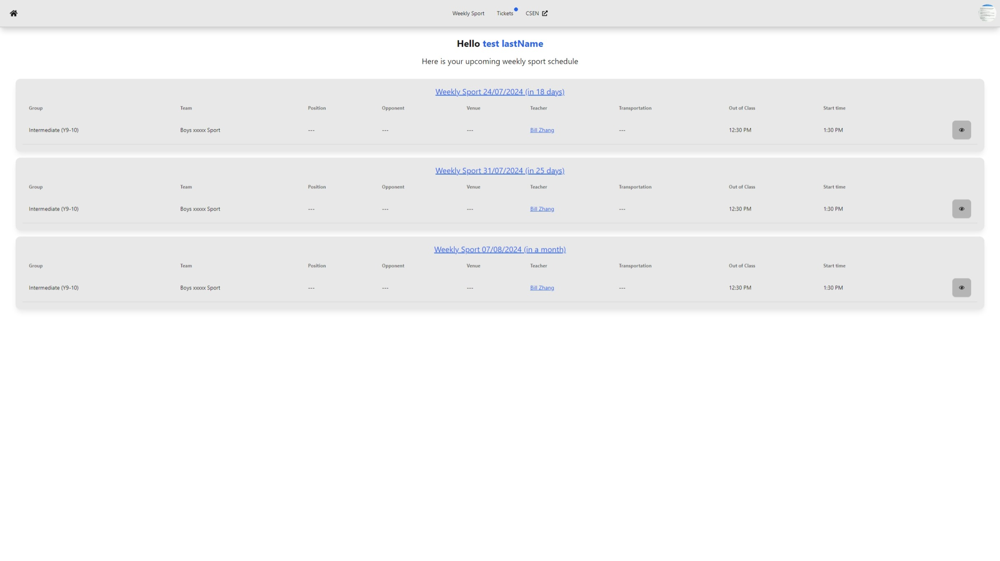
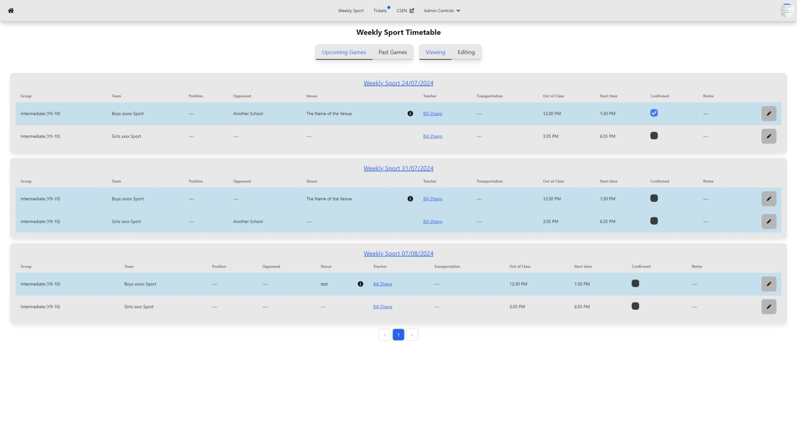
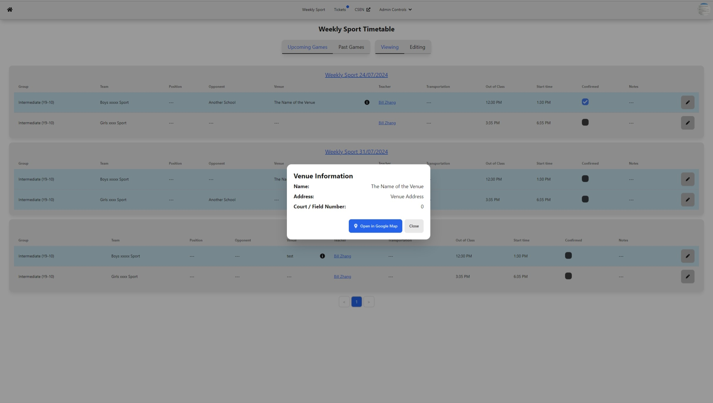
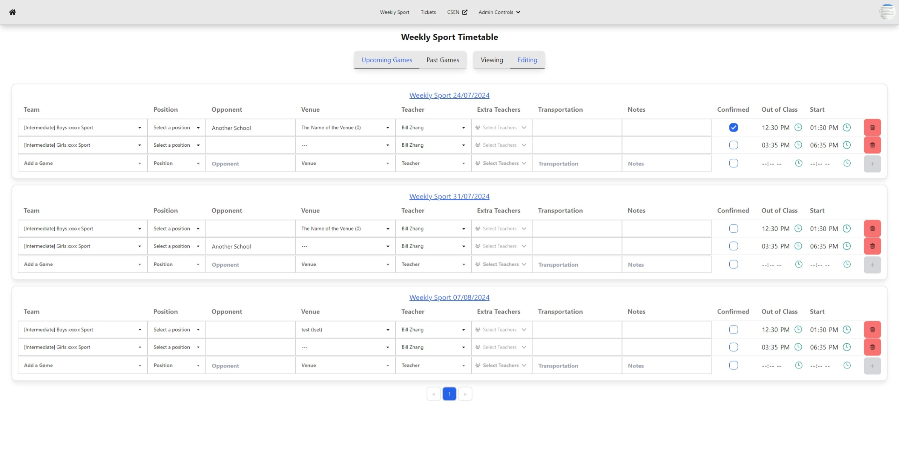
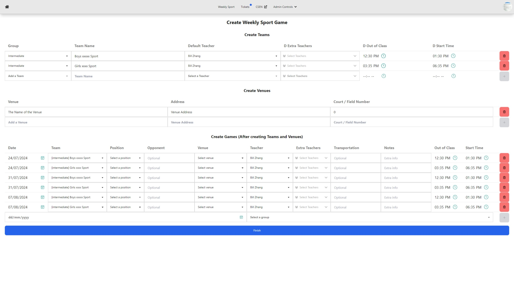
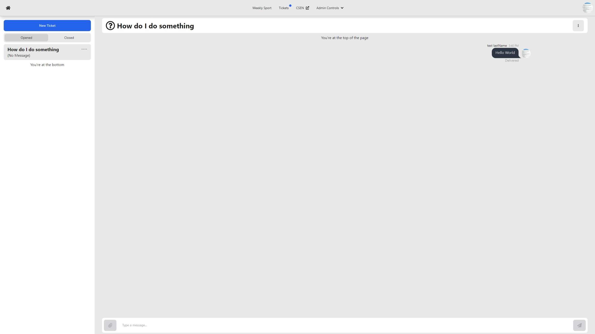
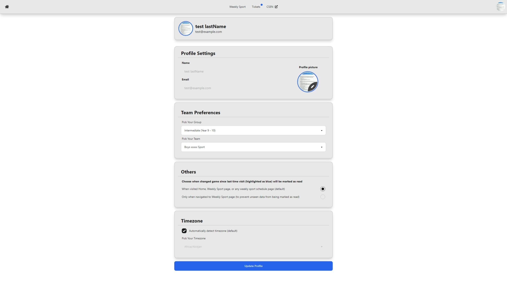
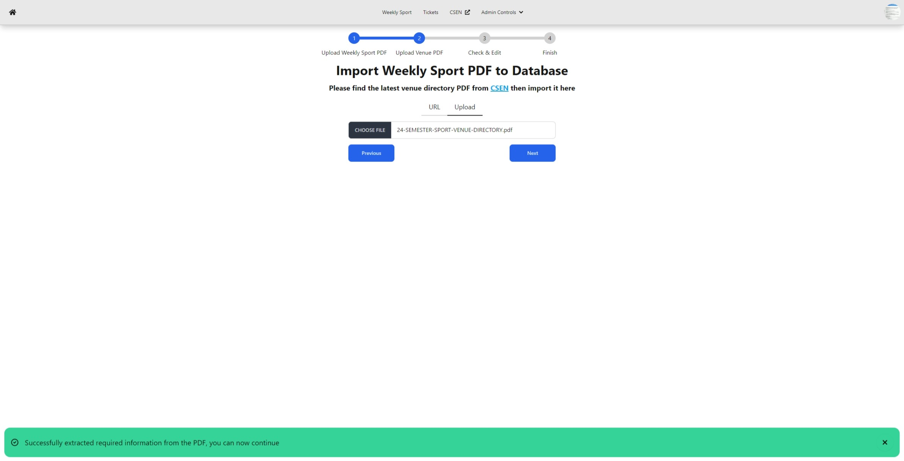
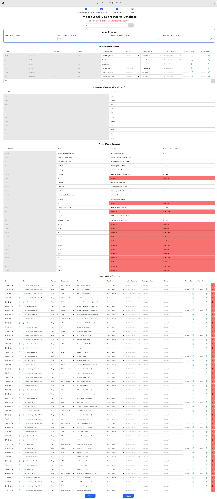

# CSEN Sport (Unofficial Schedule Organiser)

DISCLAIMER:
This project is not affiliated with the Christian Schools Events Network organisation

This project is a system designed to streamline the CSEN schedule management for schools involved in Christian Schools Event Network (CSEN). Its purpose is to ensure everyone involved has easy access to important match details by organising and distributing CSEN schedules to students, coaches, and staff.

## Features

- **User-friendly interface**: Easy to use and navigate
  

- **Schedule management**: View, add, edit, and delete schedules. Find important details like departure time, opponent, venue, and estimated time of departure (ETD)
  
  
  
  

- **Ticket system**: Ability for user to create tickets for help
  

- **Personalised Schedule**: Create a student profile to select your team and receive a personalised CSEN timetable.
  

- **Import system**: -Simple 3-step method to import Weekly Sport data to the system
  
  
  
